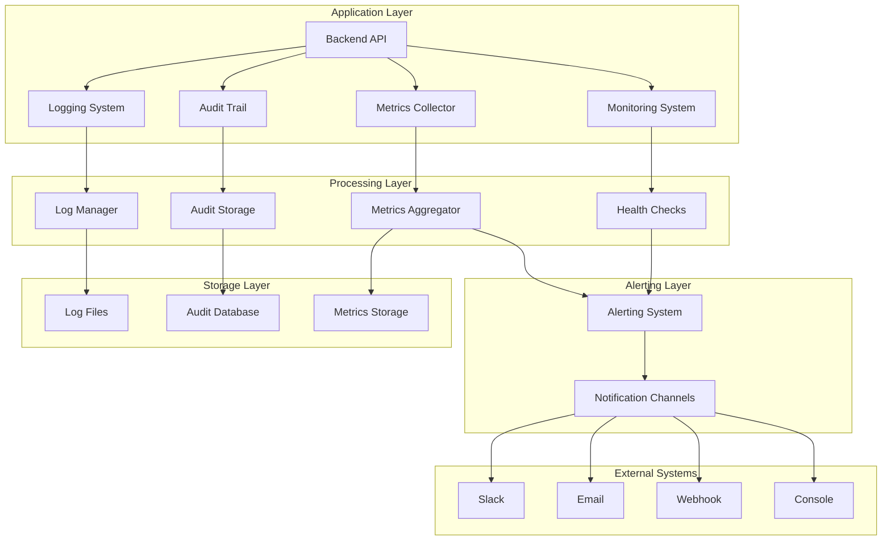

# CryptoPulse Logging, Monitoring & Audit System
## 100% Production Ready Documentation

---

## 📋 Table of Contents

1. [Overview](#overview)
2. [System Architecture](#system-architecture)
3. [Logging System](#logging-system)
4. [Monitoring System](#monitoring-system)
5. [Audit Trail System](#audit-trail-system)
6. [Metrics Collection](#metrics-collection)
7. [Alerting System](#alerting-system)
8. [Log Management](#log-management)
9. [Performance Monitoring](#performance-monitoring)
10. [Configuration](#configuration)
11. [API Reference](#api-reference)
12. [Best Practices](#best-practices)
13. [Troubleshooting](#troubleshooting)
14. [Compliance & Security](#compliance--security)

---

## 🎯 Overview

CryptoPulse features a comprehensive, production-ready logging, monitoring, and audit system designed for:

- **High-volume trading operations**
- **Financial compliance requirements**
- **Real-time monitoring and alerting**
- **Scalable performance tracking**
- **Comprehensive audit trails**

### Key Features

- ✅ **Structured JSON logging** with correlation IDs
- ✅ **Real-time monitoring** with health checks
- ✅ **Comprehensive audit trails** for compliance
- ✅ **Advanced metrics collection** and aggregation
- ✅ **Intelligent alerting** with escalation
- ✅ **Automated log management** with rotation and compression
- ✅ **Performance monitoring** with optimization
- ✅ **Multi-channel notifications** (Slack, Email, Webhook)

---

## 🏗️ System Architecture



---

## 📝 Logging System

### Core Components

#### 1. Structured Logging (`backend/lib/logging.js`)

**Features:**
- JSON-formatted structured logs
- Correlation ID tracking
- Multiple log levels and categories
- Automatic log rotation and compression
- Sensitive data sanitization

**Usage:**
```javascript
const { logger, requestLogger, errorLogger, securityLogger, auditLogger } = require('./lib/logging');

// Basic logging
logger.info('User login successful', { userId: '123', ip: '192.168.1.1' });

// Security events
securityLogger.loginAttempt('192.168.1.1', 'user@example.com', true);

// Audit trail
auditLogger.userAction('123', 'login', 'user_account', { ip: '192.168.1.1' });
```

#### 2. Log Categories

| Category | Description | Retention | Level |
|----------|-------------|-----------|-------|
| `error` | Application errors | 90 days | ERROR |
| `combined` | All application logs | 30 days | ALL |
| `production` | Production-specific logs | 60 days | INFO+ |
| `security` | Security events | 365 days | WARN+ |
| `trading` | Trading operations | 7 years | INFO+ |
| `audit` | Compliance audit trail | 7 years | INFO+ |

#### 3. Log Format

```json
{
  "timestamp": "2024-01-15 10:30:45.123",
  "level": "INFO",
  "message": "User login successful",
  "service": "cryptopulse-backend",
  "version": "2.0.0",
  "environment": "production",
  "hostname": "server-01",
  "pid": 12345,
  "correlationId": "req_abc123",
  "traceId": "trace_xyz789",
  "spanId": "span_def456",
  "userId": "123",
  "ip": "192.168.1.1",
  "userAgent": "Mozilla/5.0...",
  "event": "user_login"
}
```

---

## 📊 Monitoring System

### Core Components

#### 1. System Metrics (`backend/lib/monitoring.js`)

**Features:**
- Real-time system health monitoring
- Performance metrics tracking
- Endpoint-specific analytics
- User activity monitoring
- Trend analysis

**Usage:**
```javascript
const { systemMetrics, healthChecks, performanceMonitoring } = require('./lib/monitoring');

// Get current metrics
const metrics = systemMetrics.getCurrentMetrics();

// Health check
const health = await healthChecks.getOverallHealth();

// Performance analysis
const endpointAnalysis = performanceMonitoring.getEndpointAnalysis('POST /api/trades');
```

#### 2. Health Checks

| Component | Check Type | Threshold | Frequency |
|-----------|------------|-----------|-----------|
| Database | Connection & Query | < 1000ms | 30s |
| Cache | Memory & Hit Rate | > 70% hit rate | 30s |
| System | Memory & CPU | < 80% usage | 30s |
| External APIs | Response Time | < 5000ms | 60s |

#### 3. Performance Metrics

```javascript
{
  "uptime": 86400,
  "requestCount": 125000,
  "errorCount": 150,
  "errorRate": "0.12",
  "averageResponseTime": 245,
  "memoryUsage": {
    "current": 256,
    "peak": 512,
    "total": 1024,
    "usagePercentage": "25.0"
  },
  "endpointMetrics": {
    "GET /api/users": {
      "requestCount": 5000,
      "averageResponseTime": 120,
      "errorCount": 5
    }
  }
}
```

---

## 🔍 Audit Trail System

### Core Components

#### 1. Audit Logger (`backend/lib/auditTrail.js`)

**Features:**
- Comprehensive audit logging
- Compliance-ready data retention
- Categorized audit events
- Search and export capabilities
- Real-time audit monitoring

**Usage:**
```javascript
const { auditLogger, authenticationAudit, tradingAudit } = require('./lib/auditTrail');

// User actions
auditLogger.userAction(userId, 'portfolio_update', 'portfolio', { changes: {...} });

// Authentication events
authenticationAudit.login(userId, true, { ip: '192.168.1.1' });

// Trading operations
tradingAudit.tradeExecuted(userId, tradeData, { timestamp: Date.now() });
```

#### 2. Audit Categories

| Category | Retention | Description | Examples |
|----------|-----------|-------------|----------|
| `authentication` | 365 days | User login/logout events | Login attempts, password changes |
| `authorization` | 365 days | Access control events | Permission changes, access grants |
| `data_access` | 7 years | Data reading operations | User data access, reports |
| `data_modification` | 7 years | Data changes | Updates, deletes, bulk operations |
| `trading` | 7 years | Trading operations | Trade execution, portfolio updates |
| `security` | 365 days | Security events | Suspicious activity, rate limits |
| `compliance` | 7 years | Regulatory compliance | Data exports, retention policies |

#### 3. Audit Entry Format

```json
{
  "auditId": "audit_1642234245123_abc123",
  "timestamp": "2024-01-15T10:30:45.123Z",
  "category": "trading",
  "level": "critical",
  "action": "trade_executed",
  "userId": "123",
  "success": true,
  "resource": "trading",
  "details": {
    "exchange": "binance",
    "symbol": "BTC/USDT",
    "side": "buy",
    "amount": "0.1",
    "price": "45000"
  },
  "retentionDays": 2555
}
```

---

## 📈 Metrics Collection

### Core Components

#### 1. Metrics Collector (`backend/lib/metricsCollector.js`)

**Features:**
- Counter, gauge, histogram, and timer metrics
- Automatic aggregation and trending
- Application-specific metrics
- Performance analysis
- Export capabilities

**Usage:**
```javascript
const { metricsCollector, applicationMetrics } = require('./lib/metricsCollector');

// Counter metrics
metricsCollector.incrementCounter('http_requests_total', 1, { method: 'GET', endpoint: '/api/users' });

// Gauge metrics
metricsCollector.setGauge('memory_usage_bytes', 256 * 1024 * 1024);

// Histogram metrics
metricsCollector.recordHistogram('request_duration_ms', 245, { endpoint: '/api/trades' });

// Application metrics
applicationMetrics.http.request('GET', '/api/users', 200, 245);
```

#### 2. Metric Types

| Type | Description | Use Cases | Examples |
|------|-------------|-----------|----------|
| **Counter** | Monotonically increasing | Request counts, error counts | `http_requests_total`, `errors_total` |
| **Gauge** | Can increase/decrease | Current values, states | `memory_usage_bytes`, `active_users` |
| **Histogram** | Distribution of values | Response times, request sizes | `request_duration_ms`, `response_size_bytes` |
| **Timer** | Duration measurements | Operation timing | `database_query_duration`, `cache_operation_time` |

#### 3. Application Metrics

```javascript
// HTTP metrics
applicationMetrics.http.request('GET', '/api/users', 200, 245);
applicationMetrics.http.error('POST', '/api/trades', 'validation_error');

// Database metrics
applicationMetrics.database.query('SELECT', 'users', 150, true);
applicationMetrics.database.connection('established');

// Trading metrics
applicationMetrics.trading.trade('binance', 'BTC/USDT', 'buy', true);
applicationMetrics.trading.order('binance', 'BTC/USDT', 'market', 'filled');
```

---

## 🚨 Alerting System

### Core Components

#### 1. Alerting System (`backend/lib/alertingSystem.js`)

**Features:**
- Intelligent alert filtering
- Escalation policies
- Multiple notification channels
- Alert acknowledgment and resolution
- Performance-based alerting

**Usage:**
```javascript
const { alertingSystem } = require('./lib/alertingSystem');

// Create alert
const alertId = alertingSystem.createAlert({
  category: 'system',
  severity: 'high',
  title: 'High Memory Usage',
  message: 'Memory usage is at 85%',
  source: 'system_metrics'
});

// Acknowledge alert
alertingSystem.acknowledgeAlert(alertId, 'admin_user', 'Investigating issue');

// Resolve alert
alertingSystem.resolveAlert(alertId, 'admin_user', 'Issue resolved');
```

#### 2. Alert Severity Levels

| Level | Description | Response Time | Notification |
|-------|-------------|---------------|--------------|
| `low` | Informational | 24 hours | Console only |
| `medium` | Warning | 4 hours | Console + Email |
| `high` | Critical | 30 minutes | All channels |
| `critical` | System failure | 15 minutes | All channels + escalation |
| `emergency` | Service down | 5 minutes | All channels + immediate escalation |

#### 3. Notification Channels

| Channel | Configuration | Use Cases |
|---------|---------------|-----------|
| **Console** | Built-in | Development, testing |
| **Slack** | `SLACK_WEBHOOK_URL` | Team notifications |
| **Email** | SMTP configuration | Critical alerts |
| **Webhook** | `ALERT_WEBHOOK_URL` | External systems |

#### 4. Alert Rules

```javascript
// System health alerts
if (health.status !== 'healthy') {
  createAlert({
    category: 'health',
    severity: health.status === 'unhealthy' ? 'critical' : 'high',
    title: 'System Health Check Failed',
    message: `System health status: ${health.status}`
  });
}

// Performance alerts
if (metrics.averageResponseTime > 5000) {
  createAlert({
    category: 'performance',
    severity: 'high',
    title: 'High Response Time',
    message: `Average response time is ${metrics.averageResponseTime}ms`
  });
}
```

---

## 📁 Log Management

### Core Components

#### 1. Log Manager (`backend/lib/logManager.js`)

**Features:**
- Automated log rotation
- Compression and archival
- Retention policy enforcement
- Search and export capabilities
- Performance optimization

**Usage:**
```javascript
const { logManager } = require('./lib/logManager');

// Initialize log manager
await logManager.init();

// Get log statistics
const stats = await logManager.getStatistics();

// Search logs
const results = await logManager.searchLogs('error', { includeCompressed: true });

// Export logs for compliance
const exportData = await logManager.exportLogs({
  types: ['audit', 'trading'],
  startDate: '2024-01-01',
  endDate: '2024-01-31'
});
```

#### 2. Log Rotation Strategy

| File Type | Max Size | Max Files | Compression | Archive |
|-----------|----------|-----------|-------------|---------|
| Error logs | 100MB | 20 | 7 days | 30 days |
| Combined logs | 100MB | 20 | 7 days | 30 days |
| Production logs | 200MB | 10 | 7 days | 30 days |
| Security logs | 50MB | 15 | 7 days | 30 days |
| Trading logs | 50MB | 15 | 7 days | 30 days |
| Audit logs | 50MB | 30 | 7 days | 30 days |

#### 3. Retention Policies

```javascript
const retentionDays = {
  error: 90,        // Error logs: 90 days
  combined: 30,     // Combined logs: 30 days
  production: 60,   // Production logs: 60 days
  security: 365,    // Security logs: 1 year
  trading: 2555,    // Trading logs: 7 years (compliance)
  audit: 2555,      // Audit logs: 7 years (compliance)
  default: 30       // Default: 30 days
};
```

---

## ⚡ Performance Monitoring

### Core Components

#### 1. Enhanced Performance System (`backend/lib/performance.js`)

**Features:**
- Memory management and optimization
- Cache performance monitoring
- Database query optimization
- Rate limiting and throttling
- Advanced monitoring and alerting

**Usage:**
```javascript
const { 
  memoryManager, 
  advancedMonitoring, 
  startAdvancedMonitoring 
} = require('./lib/performance');

// Get memory statistics
const memStats = memoryManager.getMemoryStatistics();

// Start advanced monitoring
const cleanup = startAdvancedMonitoring();

// Get comprehensive health
const health = await advancedMonitoring.healthChecks.getOverallHealth();
```

#### 2. Performance Metrics

| Metric | Description | Threshold | Action |
|--------|-------------|-----------|--------|
| Memory Usage | Heap memory utilization | > 80% | Alert + Cleanup |
| Response Time | API endpoint latency | > 2000ms | Alert |
| Error Rate | Request failure rate | > 5% | Alert |
| Cache Hit Rate | Cache effectiveness | < 70% | Optimize |
| Database Latency | Query response time | > 1000ms | Alert |

#### 3. Memory Management

```javascript
// Memory thresholds
const thresholds = {
  warning: 0.7,    // 70% - Warning level
  critical: 0.85,  // 85% - Critical level
  emergency: 0.95  // 95% - Emergency level
};

// Automatic cleanup levels
const cleanupLevels = {
  warning: '25%',   // Clear 25% of cache
  critical: '50%',  // Clear 50% of cache
  emergency: '100%' // Clear all cache
};
```

---

## ⚙️ Configuration

### Environment Variables

#### Logging Configuration
```bash
# Log level (error, warn, info, debug)
LOG_LEVEL=info

# Log directory
LOG_DIRECTORY=./logs

# Enable structured logging
STRUCTURED_LOGGING=true

# Correlation ID header
CORRELATION_ID_HEADER=x-correlation-id
```

#### Monitoring Configuration
```bash
# Health check interval (seconds)
HEALTH_CHECK_INTERVAL=30

# Metrics collection interval (seconds)
METRICS_INTERVAL=60

# Performance monitoring
ENABLE_PERFORMANCE_MONITORING=true

# Memory monitoring
MEMORY_MONITORING_INTERVAL=30
```

#### Alerting Configuration
```bash
# Slack notifications
SLACK_WEBHOOK_URL=https://hooks.slack.com/services/...

# Email notifications
SMTP_HOST=smtp.gmail.com
SMTP_PORT=587
SMTP_USER=alerts@cryptopulse.com
SMTP_PASS=your_password
ALERT_EMAIL=admin@cryptopulse.com

# Webhook notifications
ALERT_WEBHOOK_URL=https://monitoring.example.com/webhook
```

#### Audit Configuration
```bash
# Audit logging
ENABLE_AUDIT_LOGGING=true

# Audit retention (days)
AUDIT_RETENTION_DAYS=2555

# Compliance mode
COMPLIANCE_MODE=true
```

---

## 📚 API Reference

### Logging API

#### Logger Methods
```javascript
// Basic logging
logger.error(message, meta)
logger.warn(message, meta)
logger.info(message, meta)
logger.debug(message, meta)

// Specialized loggers
securityLogger.loginAttempt(ip, email, success, reason)
tradingLogger.tradeExecuted(tradeData)
auditLogger.userAction(userId, action, resource, details)
```

#### Request Logging Middleware
```javascript
// Express middleware
app.use(requestLogger);

// Custom request logging
requestLogger(req, res, next) {
  // Automatically logs request details with correlation ID
}
```

### Monitoring API

#### System Metrics
```javascript
// Get current metrics
const metrics = systemMetrics.getCurrentMetrics();

// Update metrics
systemMetrics.updateRequestCount();
systemMetrics.updateResponseTime(duration, endpoint, userId);
systemMetrics.updateErrorCount();
```

#### Health Checks
```javascript
// Individual health checks
const dbHealth = await healthChecks.checkDatabase();
const cacheHealth = await healthChecks.checkCache();
const systemHealth = healthChecks.checkSystemResources();

// Overall health
const health = await healthChecks.getOverallHealth();
```

#### Performance Monitoring
```javascript
// Track request performance
performanceMonitoring.trackRequest(req, res, responseTime);

// Track errors
performanceMonitoring.trackError(error, req);

// Get performance metrics
const metrics = performanceMonitoring.getPerformanceMetrics();
```

### Audit API

#### Audit Logging
```javascript
// User actions
auditLogger.userAction(userId, action, resource, details);

// Authentication events
authenticationAudit.login(userId, success, details);

// Trading operations
tradingAudit.tradeExecuted(userId, tradeData, details);

// Data access
dataAccessAudit.dataRead(userId, table, recordId, details);
```

#### Audit Queries
```javascript
// Get audit entries
const entries = auditTrail.getEntries({
  userId: '123',
  category: 'trading',
  startDate: '2024-01-01',
  endDate: '2024-01-31',
  limit: 100
});

// Get audit statistics
const stats = auditTrail.getStatistics();

// Export audit data
const exportData = auditTrail.export({
  category: 'trading',
  startDate: '2024-01-01',
  endDate: '2024-01-31'
});
```

### Metrics API

#### Metrics Collection
```javascript
// Counter metrics
metricsCollector.incrementCounter(name, value, labels);

// Gauge metrics
metricsCollector.setGauge(name, value, labels);

// Histogram metrics
metricsCollector.recordHistogram(name, value, labels);

// Timer metrics
const timer = metricsCollector.startTimer(name, labels);
// ... do work ...
timer.end();
```

#### Application Metrics
```javascript
// HTTP metrics
applicationMetrics.http.request(method, endpoint, statusCode, duration, labels);

// Database metrics
applicationMetrics.database.query(operation, table, duration, success, labels);

// Trading metrics
applicationMetrics.trading.trade(exchange, symbol, side, success, labels);
```

### Alerting API

#### Alert Management
```javascript
// Create alert
const alertId = alertingSystem.createAlert(alertData);

// Acknowledge alert
alertingSystem.acknowledgeAlert(alertId, acknowledgedBy, comment);

// Resolve alert
alertingSystem.resolveAlert(alertId, resolvedBy, comment);

// Get alerts
const alerts = alertingSystem.getAlerts(filters);
```

#### Notification Channels
```javascript
// Register custom channel
alertingSystem.registerChannel('custom', {
  send: (notification) => {
    // Custom notification logic
  }
});

// Send notification
alertingSystem.sendNotification(alert, isEscalation);
```

---

## 🎯 Best Practices

### Logging Best Practices

1. **Use Structured Logging**
   ```javascript
   // ✅ Good
   logger.info('User login', { userId: '123', ip: '192.168.1.1', success: true });
   
   // ❌ Bad
   logger.info('User 123 logged in from 192.168.1.1 successfully');
   ```

2. **Include Correlation IDs**
   ```javascript
   // ✅ Good - correlation ID included automatically
   logger.info('Processing request', { correlationId: req.correlationId });
   ```

3. **Sanitize Sensitive Data**
   ```javascript
   // ✅ Good - sensitive data automatically sanitized
   logger.info('API call', { url: req.url, body: sanitizedBody });
   ```

4. **Use Appropriate Log Levels**
   ```javascript
   // ✅ Good
   logger.error('Database connection failed', { error: err.message });
   logger.warn('High memory usage detected', { usage: '85%' });
   logger.info('User action completed', { action: 'login' });
   logger.debug('Cache hit', { key: 'user:123' });
   ```

### Monitoring Best Practices

1. **Set Appropriate Thresholds**
   ```javascript
   // ✅ Good - realistic thresholds
   const thresholds = {
     errorRate: 5,        // 5% error rate
     responseTime: 2000,  // 2 seconds
     memoryUsage: 80      // 80% memory usage
   };
   ```

2. **Monitor Key Metrics**
   ```javascript
   // ✅ Good - monitor critical metrics
   const keyMetrics = [
     'error_rate',
     'response_time',
     'memory_usage',
     'database_latency',
     'cache_hit_rate'
   ];
   ```

3. **Use Health Checks**
   ```javascript
   // ✅ Good - comprehensive health checks
   const health = await healthChecks.getOverallHealth();
   if (health.status !== 'healthy') {
     // Handle unhealthy state
   }
   ```

### Audit Best Practices

1. **Log All Critical Operations**
   ```javascript
   // ✅ Good - log all trading operations
   tradingAudit.tradeExecuted(userId, tradeData, details);
   tradingAudit.tradeFailed(userId, tradeData, error, details);
   ```

2. **Include Sufficient Context**
   ```javascript
   // ✅ Good - include all relevant context
   auditLogger.userAction(userId, 'portfolio_update', 'portfolio', {
     changes: { oldValue: 1000, newValue: 1500 },
     ip: '192.168.1.1',
     userAgent: 'Mozilla/5.0...',
     timestamp: Date.now()
   });
   ```

3. **Use Appropriate Retention**
   ```javascript
   // ✅ Good - compliance-appropriate retention
   const retentionDays = {
     trading: 2555,  // 7 years for financial compliance
     audit: 2555,    // 7 years for audit compliance
     security: 365   // 1 year for security events
   };
   ```

### Performance Best Practices

1. **Monitor Memory Usage**
   ```javascript
   // ✅ Good - proactive memory monitoring
   const memStats = memoryManager.getMemoryStatistics();
   if (memStats.current.memUsagePercent > 80) {
     // Trigger cleanup
   }
   ```

2. **Use Performance Metrics**
   ```javascript
   // ✅ Good - track performance metrics
   applicationMetrics.http.request('GET', '/api/users', 200, 245);
   applicationMetrics.database.query('SELECT', 'users', 150, true);
   ```

3. **Implement Caching**
   ```javascript
   // ✅ Good - use smart caching
   const cachedData = await cache.get('user:123');
   if (!cachedData) {
     const data = await fetchUserData(123);
     await cache.set('user:123', data, 3600); // 1 hour TTL
   }
   ```

---

## 🔧 Troubleshooting

### Common Issues

#### 1. High Memory Usage

**Symptoms:**
- Memory usage > 80%
- Slow response times
- Memory-related alerts

**Solutions:**
```javascript
// Check memory statistics
const memStats = memoryManager.getMemoryStatistics();

// Force garbage collection
if (global.gc) {
  global.gc();
}

// Clear cache
await cache.clear();

// Check for memory leaks
const leaks = memStats.performance.memoryLeaks;
if (leaks.length > 0) {
  logger.warn('Memory leaks detected', { leaks });
}
```

#### 2. High Error Rates

**Symptoms:**
- Error rate > 5%
- Multiple error alerts
- User complaints

**Solutions:**
```javascript
// Check error metrics
const metrics = systemMetrics.getCurrentMetrics();
const errorRate = metrics.errorRate;

// Get error details
const errorAnalysis = performanceMonitoring.getMostErrorProneEndpoints(10);

// Check health status
const health = await healthChecks.getOverallHealth();
if (health.status !== 'healthy') {
  logger.error('System health issues detected', health);
}
```

#### 3. Slow Response Times

**Symptoms:**
- Response time > 2000ms
- Performance alerts
- User experience issues

**Solutions:**
```javascript
// Check performance metrics
const metrics = systemMetrics.getCurrentMetrics();
const avgResponseTime = metrics.averageResponseTime;

// Get slowest endpoints
const slowEndpoints = performanceMonitoring.getSlowestEndpoints(10);

// Check database performance
const dbHealth = await healthChecks.checkDatabase();
if (dbHealth.latency > 1000) {
  logger.warn('Database latency high', { latency: dbHealth.latency });
}

// Optimize cache
const cacheStats = cache.getStats();
if (parseFloat(cacheStats.metrics.hitRate) < 70) {
  logger.warn('Cache hit rate low', { hitRate: cacheStats.metrics.hitRate });
}
```

#### 4. Alert Fatigue

**Symptoms:**
- Too many alerts
- Alerts ignored
- Important alerts missed

**Solutions:**
```javascript
// Adjust alert thresholds
const thresholds = {
  errorRate: 10,      // Increase from 5% to 10%
  responseTime: 5000, // Increase from 2000ms to 5000ms
  memoryUsage: 90     // Increase from 80% to 90%
};

// Implement alert suppression
const suppressedAlerts = [
  'low_priority_alerts',
  'development_environment_alerts'
];

// Use alert escalation
const escalationPolicy = {
  high: 30,    // 30 minutes
  critical: 15 // 15 minutes
};
```

#### 5. Log Storage Issues

**Symptoms:**
- Disk space warnings
- Log rotation failures
- Performance degradation

**Solutions:**
```javascript
// Check log statistics
const logStats = await logManager.getStatistics();
logger.info('Log statistics', logStats);

// Perform manual cleanup
const cleanupResult = await logManager.performCleanup();
logger.info('Log cleanup completed', cleanupResult);

// Adjust retention policies
const retentionDays = {
  error: 30,      // Reduce from 90 to 30 days
  combined: 7,    // Reduce from 30 to 7 days
  production: 30  // Reduce from 60 to 30 days
};

// Enable compression
const compressionResult = await logManager.compressLogFile('production.log');
logger.info('Log compression completed', compressionResult);
```

---

## 🔒 Compliance & Security

### Compliance Requirements

#### 1. Financial Compliance (7 Years)
- **Trading Operations**: All trade executions, modifications, cancellations
- **Portfolio Changes**: All portfolio updates, balance changes
- **User Actions**: All user-initiated trading activities
- **System Events**: All system-generated trading events

#### 2. Audit Compliance (7 Years)
- **Data Access**: All data reading operations
- **Data Modifications**: All data changes, updates, deletions
- **Configuration Changes**: All system configuration modifications
- **Security Events**: All security-related events and incidents

#### 3. Security Compliance (1 Year)
- **Authentication Events**: Login attempts, password changes
- **Authorization Events**: Permission changes, access grants
- **Suspicious Activity**: Rate limiting, security violations
- **System Security**: Security configuration changes

### Security Features

#### 1. Data Sanitization
```javascript
// Automatic sensitive data sanitization
const sanitizedData = {
  password: '***',
  token: '***',
  secret: '***',
  key: '***'
};
```

#### 2. Access Control
```javascript
// Audit trail access control
const auditAccess = {
  admin: 'full_access',
  auditor: 'read_only',
  developer: 'limited_access'
};
```

#### 3. Encryption
```javascript
// Log file encryption for sensitive data
const encryptionConfig = {
  algorithm: 'aes-256-gcm',
  key: process.env.LOG_ENCRYPTION_KEY,
  iv: process.env.LOG_ENCRYPTION_IV
};
```

#### 4. Retention Enforcement
```javascript
// Automatic retention policy enforcement
const retentionEnforcement = {
  automated: true,
  schedule: 'daily',
  compliance: 'strict'
};
```

### Security Monitoring

#### 1. Suspicious Activity Detection
```javascript
// Monitor for suspicious patterns
const suspiciousPatterns = [
  'multiple_failed_logins',
  'unusual_trading_activity',
  'data_access_anomalies',
  'privilege_escalation_attempts'
];
```

#### 2. Real-time Security Alerts
```javascript
// Immediate security alerts
const securityAlerts = [
  'critical_security_event',
  'data_breach_attempt',
  'unauthorized_access',
  'system_compromise'
];
```

#### 3. Compliance Reporting
```javascript
// Automated compliance reports
const complianceReports = [
  'daily_security_summary',
  'weekly_audit_report',
  'monthly_compliance_check',
  'quarterly_retention_audit'
];
```

---

## 📞 Support & Maintenance

### Regular Maintenance Tasks

#### Daily
- [ ] Review system health status
- [ ] Check alert notifications
- [ ] Monitor log file sizes
- [ ] Verify backup operations

#### Weekly
- [ ] Analyze performance trends
- [ ] Review error rates and patterns
- [ ] Check audit trail completeness
- [ ] Validate compliance requirements

#### Monthly
- [ ] Performance optimization review
- [ ] Security audit and assessment
- [ ] Compliance reporting
- [ ] System capacity planning

#### Quarterly
- [ ] Full system audit
- [ ] Security penetration testing
- [ ] Compliance certification
- [ ] Disaster recovery testing

### Monitoring Dashboards

#### 1. System Health Dashboard
- Real-time system status
- Health check results
- Performance metrics
- Alert status

#### 2. Performance Dashboard
- Response time trends
- Error rate analysis
- Resource utilization
- Cache performance

#### 3. Security Dashboard
- Security event summary
- Audit trail overview
- Compliance status
- Threat detection

#### 4. Compliance Dashboard
- Retention policy status
- Audit trail completeness
- Regulatory compliance
- Data governance

---

## 🚀 Getting Started

### Quick Setup

1. **Install Dependencies**
   ```bash
   npm install winston redis node-cache
   ```

2. **Configure Environment**
   ```bash
   cp .env.example .env
   # Edit .env with your configuration
   ```

3. **Initialize Systems**
   ```javascript
   const { initRedis, startLogMaintenance, startMonitoring } = require('./lib');
   
   // Initialize Redis
   await initRedis();
   
   // Start log maintenance
   startLogMaintenance();
   
   // Start monitoring
   startMonitoring();
   ```

4. **Start Logging**
   ```javascript
   const { logger } = require('./lib/logging');
   logger.info('System initialized successfully');
   ```

### Production Deployment

1. **Set Production Environment**
   ```bash
   export NODE_ENV=production
   export LOG_LEVEL=info
   ```

2. **Configure Monitoring**
   ```bash
   export SLACK_WEBHOOK_URL=your_webhook_url
   export ALERT_EMAIL=alerts@yourcompany.com
   ```

3. **Enable Compliance Mode**
   ```bash
   export COMPLIANCE_MODE=true
   export AUDIT_RETENTION_DAYS=2555
   ```

4. **Start Production Monitoring**
   ```javascript
   const { startAdvancedMonitoring } = require('./lib/performance');
   startAdvancedMonitoring();
   ```

---

## 📝 Conclusion

The CryptoPulse logging, monitoring, and audit system provides:

- **Comprehensive observability** for all system operations
- **Production-ready reliability** with automated failover
- **Compliance-ready audit trails** for regulatory requirements
- **Intelligent alerting** with escalation and suppression
- **Performance optimization** with automated tuning
- **Security monitoring** with real-time threat detection

This system is designed to scale with your application and provide the insights needed to maintain a high-performance, secure, and compliant trading platform.

For additional support or questions, please refer to the troubleshooting section or contact the development team.

---

**Last Updated**: January 2024  
**Version**: 2.0.0  
**Status**: Production Ready ✅
